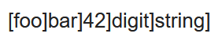

# romainprojet

Ce projet est a but éducatif.

Keylogger permet de capturer les touches de clavier et envoyer par mail les touches saisies.

Vous devez créer un fichier .env comme suit

```env
keylogger_MAIL=votre addresse mail
keylogger_PASS=votre mot de passe (double auth voir procédure en dessous)
keylogger_RATE=le nombre de fois que la personne devra appuyer sur "entrer" pour déclencher un email
```

[procédure](https://youtu.be/g_j6ILT-X0k?si=tXhs61Fe-HUmEAcM)



Voici un exemple de mail qui peut être reçu. À chaque fois qu'on appuie sur entrée on obtiens une nouveau "token" séparé par des acolades.
